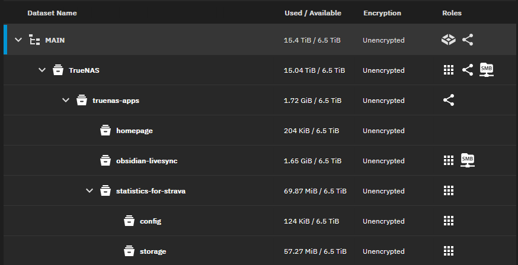
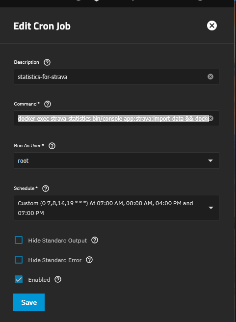
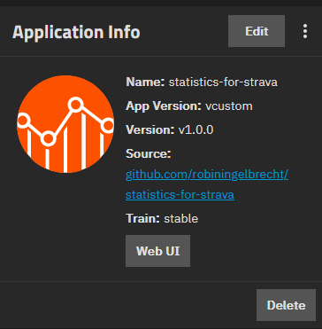

# TrueNAS Scale (Fangtooth)

[TrueNAS Scale](https://www.truenas.com/truenas-community-edition/) in a common NAS environment with docker-compose support.
This guide will help you set up Statistics for Strava as a TrueNAS App container.

<div class="alert important">
As always, exercise caution when doing anything in the TrueNAS CLI.
</div>

<div class="alert important">
Thanks to <a href="https://github.com/mavproductions" target="_blank">mavproductions</a> for creating this guide and sharing it with the community.
</div>

### Create your Datasets

On the Datasets page, create your new Dataset residing in your primary disk pool.
Call it statistics-for-strava with the apps preset. After that, create child datasets for build, config, and storage.


### Stage your .ENV and config.yaml
Create the following files in your datasets using the examples [provided here](https://statistics-for-strava-docs.robiningelbrecht.be/#/getting-started/installation?id=env):
`/statistics-for-strava/.env`
`/statistics-for-strava/config/config.yaml`


### Create your Custom YAML app
Use the following as a template calling the app "statistics-for-strava"
```yaml
services:
  app:
    container_name: strava-statistics
    env_file: /mnt/MAIN/TrueNAS/truenas-apps/statistics-for-strava/.env
    image: robiningelbrecht/strava-statistics:latest
    ports:
      - '8080:8080'
    restart: unless-stopped
    volumes:
      - /mnt/POOLHERE/path/to/statistics-for-strava/build:/var/www/build
      - /mnt/POOLHERE/path/to/statistics-for-strava/storage/database:/var/www/storage/database
      - /mnt/POOLHERE/path/to/statistics-for-strava/storage/files:/var/www/storage/files
      - /mnt/POOLHERE/path/to/statistics-for-strava/storage/gear-maintenance:/var/www/storage/gear-maintenance
      - /mnt/POOLHERE/path/to/statistics-for-strava/config:/var/www/config/app
```

Click save to launch the app and begin maintaining this YAML configuration. 

Now follow the instructions on the [installation page](/getting-started/installation.md) to set up Statistics for Strava.

### Strava API integration

Now follow the instructions on the [prerequisites page](/getting-started/prerequisites.md) to create the API keys/secret on the Strava website 
and add the keys to your .env file in your Statistics-for-strava directory using `nano .env`

Restart the statistics-for-strava app.

### Final steps

* Open the URL of your container (IP:8080), choose "Connect with Strava".
* A new refresh token will be generated
* Add it to the .env file in your container using `nano .env`
* Restart your TrueNAS App

### Create cron schedules
Navigate to `TrueNAS > System > Advanced Settings > Cron Jobs` and add `docker exec strava-statistics bin/console app:strava:import-data && docker compose exec app bin/console app:strava:build-files` as the command, running as root user.


### Fix your TrueNAS app listing:
From TrueNAS Shell, navigate to run `sudo nano /mnt/.ix-apps/app_configs/statistics-for-strava/metadata.yaml` and use below as a template:
```yaml
custom_app: true
human_version: 1.0.0_custom
metadata:
  app_version: custom
  capabilities: []
  description: Self-hosted, open-source dashboard for your Strava data.
  icon: https://cdn.jsdelivr.net/gh/selfhst/icons/svg/strava-statistics.svg
  home: ''
  host_mounts: []
  maintainers: []
  name: statistics-for-strava
  run_as_context: []
  sources:
    - https://github.com/robiningelbrecht/statistics-for-strava
  title: Statistics For Strava
  train: stable
  version: 1.0.0
migrated: false
notes: See https://statistics-for-strava-docs.robiningelbrecht.be for further help and documentation.
portals: 
  Web UI: http://0.0.0.0:8080
version: 1.0.0
```

After you save(CTRL+O) your nano session, on the apps page, select statistics-for-strava, click the grey Edit button near "Application Info", and click the blue save button. This not only updates the docker-compose contents, but also propagates the `metadata.yaml` changes. You might also need to use CTRL+SHIFT+R to force a refresh of your TrueNAS Apps page.



<div class="alert success">
You're all set :partying_face:! You can now <a href="/#/getting-started/installation?id=import-and-build-statistics">import and build</a> your statistics. 
</div>
